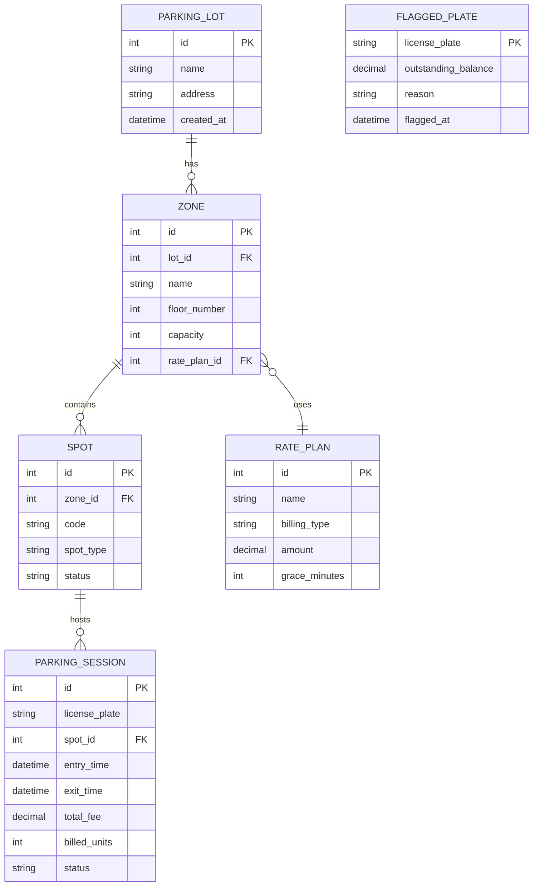

# ERD - Parking Lot Management API

## Diagram

## Notes on each table

**parking_lot** is the building. A company can run more than one, so it
gets its own table.

**zone** is a section inside a lot, like "Zone A" or "EV Zone". I keep
the floor number on the zone itself. At first I had a separate `level`
table but I never used it on its own, so I dropped it.

**spot** is one parking space. It belongs to a zone. The status field
is `available`, `occupied`, or `out_of_service`. Postgres is the truth
for this. Redis only keeps a counter per zone.

**parking_session** is the main table. Every entry creates a row,
every exit closes it. I store the plate as a string here, no separate
vehicle table. Only one session per plate can be `active` at a time,
I will add a partial unique index for that in Phase 2. `billed_units`
is what was actually charged (minutes or hours), I include it in the
receipt so the user sees how the fee was calculated.

**rate_plan** holds pricing. `billing_type` is either `per_minute` or
`per_hour`. `grace_minutes` is a free window at the start. If you stop
for 3 minutes to drop someone off you do not get charged.

**flagged_plate** is the unpaid list. If a driver leaves without paying,
staff adds the plate here with the amount owed. Next time the same plate
tries to exit, the API blocks it with 403 until the debt is cleared.
The plate string is the primary key, no extra id, since every `/exit`
needs to look it up by plate.